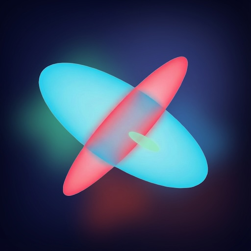
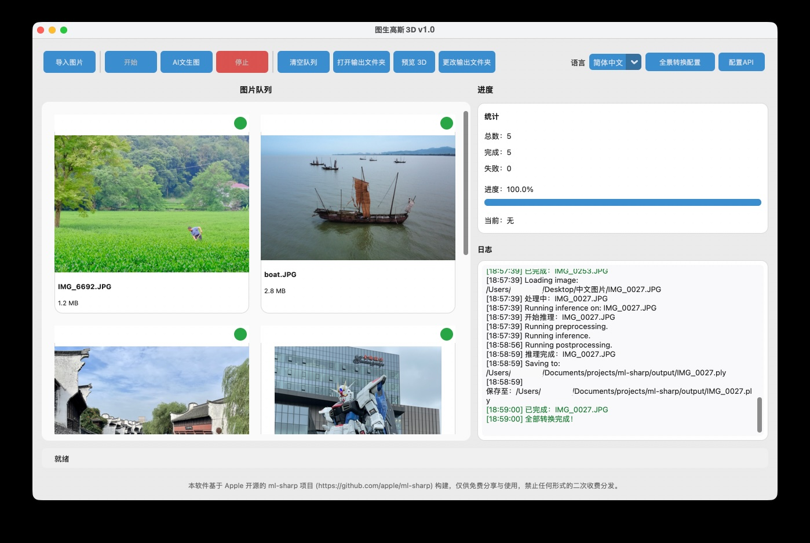
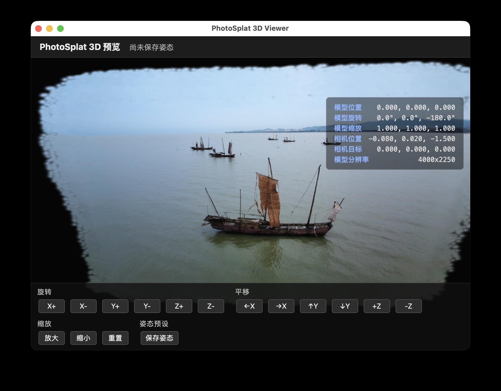

# PhotoSplat3D

<p align="center">
    
</p>

<p align="center">
  <strong>照片秒变 3D — 完全本地，无需联网</strong>
</p>

<p align="center">
  <a href="README.md">English Documentation</a> •
  <a href="#下载">下载</a> •
  <a href="#快速开始">快速开始</a> •
  <a href="#核心功能">核心功能</a>
</p>

---

基于 Apple [ml-sharp](https://apple.github.io/ml-sharp/) 开源项目的开箱即用版本(带 GUI)，支持单张图片 快速生成 3D Gaussian Splatting（3DGS）高斯泼溅模型。

官方网站: <https://www.photosplat3d.com/>

<p align="center">
    
</p>

<p align="center">
    
</p>

## 下载

### 🖥️ Mac 应用（完整版）
**[下载 PhotoSplat3D Mac 版本](https://r2.photosplat3d.com/PhotoSplat3D_v1.0.dmg)**

一键将 2D 照片转换为 3D 高斯泼溅模型。

**功能特性：**

- 支持普通照片和 180°/360° 全景照片
- 批量处理
- 本地渲染
- AI 文生图 (基于 Nano Banana Pro)

**系统要求：** 搭载 Apple Silicon (M2 或更高) 的 macOS

### 📱 Vision Pro 应用
**[App Store 下载](https://apps.apple.com/us/app/%E5%9B%BE%E7%94%9F%E9%AB%98%E6%96%AF-3d/id6757570552?l=zh-Hans-CN)**

直接在 Apple Vision Pro 上创建和探索 3D 高斯泼溅模型。

**功能特性：**

- 设备端照片转 3D
- 导入和查看 .ply 文件
- 手势控制空间交互
- 完全私密 — 无云端，无上传

**系统要求：** Apple Vision Pro 搭载 Apple Silicon (M2 或M5版本) 的 visionOS 26+

---

## 核心功能

- 📸 **单图生成 3D 场景**：将任意照片转换为 `.ply` 高斯泼溅模型
- 🖥️ **桌面图形界面**：基于 CustomTkinter 的友好界面
- ⌨️ **命令行工作流**：支持批处理和自动渲染
- 🌐 **全景支持**：180° 和 360° 等距柱状投影预处理
- 🎨 **多种策略**：Cube6、Ring8、Ring12、Front4、Front6 投影模式
- ⚡ **灵活计算**：支持 CPU、MPS (Apple Silicon) 或 CUDA

---

## 快速开始

### 环境要求

开始之前，请确保您已安装：

- **Git**（用于克隆代码仓库）
- **Python 3.10+**（推荐 Python 3.13）
  - 必须包含 `venv` 和 `tkinter` 模块
- **操作系统**：macOS 或 Linux
- **网络连接**：用于下载依赖和模型
- **可选 GPU**：
  - 推理：CPU / MPS / CUDA
  - 视频渲染：仅 CUDA

**验证环境：**

```bash
git --version
python3 --version
python3 -m venv --help
python3 -m tkinter
```

### 安装

**方式 1：自动安装（推荐）**

```bash
git clone https://github.com/zlinoliver/PhotoSplat3D.git
cd ml-sharp
bash scripts/bootstrap.sh
```

自动脚本将：

- 创建虚拟环境
- 验证 Python 版本和依赖
- 安装所有必需的包
- 以可编辑模式设置项目

**方式 2：手动安装**

```bash
python3 -m venv venv
source venv/bin/activate
pip install --upgrade pip
pip install -r requirements.txt
pip install -e .
```

### 使用方法

**启动图形界面：**

```bash
sharp gui
```

或者：

```bash
PYTHONPATH=src python3 -m sharp.gui.launcher
```

**命令行界面：**

```bash
# 从图片生成 3D .ply 文件
sharp predict -i input/ -o output/

# 渲染轨迹视频（需要 CUDA）
sharp render -i output/ -o output/renderings/
```

### 首次运行说明

- 首次推理时会自动下载模型权重（约 300MB）
- 默认缓存位置：`~/.cache/torch/hub/checkpoints/`
- GUI 默认输出目录：`~/Desktop/SHARP_Output`

---

## 命令行选项

### `sharp predict`

将图片转换为 3D 高斯泼溅模型。

```bash
sharp predict -i INPUT -o OUTPUT [选项]
```

**常用选项：**

| 选项 | 值 | 说明 |
|------|-----|------|
| `--device` | `default`, `cpu`, `mps`, `cuda` | 计算设备 |
| `--render` | - | 生成预览渲染（推荐 CUDA）|
| `--panorama` | `auto`, `180`, `360`, `none` | 全景检测模式 |
| `--panorama-strategy` | `cube6`, `ring8`, `ring12`, `front4`, `front6` | 投影策略 |
| `--panorama-face-size` | `<整数>` | 每个面/视图的分辨率 |

**示例：**

```bash
# 自动检测全景
sharp predict -i photos/ -o output/ --panorama auto

# 强制 360° 全景，使用 Ring8 策略
sharp predict -i pano.jpg -o output/ --panorama 360 --panorama-strategy ring8

# 使用 CUDA 并渲染预览
sharp predict -i input/ -o output/ --device cuda --render
```

---

## 构建桌面应用

构建独立的 macOS 应用程序：

```bash
bash scripts/bootstrap.sh
source venv/bin/activate
python build_release.py --mode full
```

**输出文件：**

- `dist/PhotoSplat3D.app` — 独立应用程序
- `releases/PhotoSplat3D-*-macOS.zip` — 可分发压缩包

---

## 项目结构

```
ml-sharp/
├── src/sharp/
│   ├── cli/          # 命令行接口 (predict, render, gui)
│   ├── gui/          # 桌面图形界面
│   ├── models/       # SHARP 模型定义
│   └── utils/        # I/O、相机、高斯、渲染工具
├── viewer/           # Web 查看器静态资源
├── scripts/          # 安装和构建脚本
└── requirements.txt  # Python 依赖
```

---

## 隐私与配置

- **本地配置**：`~/.sharp_config.json`
- **环境变量**：参见 `.env.example` 了解可选设置
- **无追踪**：不包含任何个人数据或硬编码端点

---

## 参与贡献

我们欢迎贡献！请阅读：

- [CONTRIBUTING.md](CONTRIBUTING.md) — 贡献指南
- [.github/ISSUE_TEMPLATE/](.github/ISSUE_TEMPLATE/) — Issue 模板
- [SECURITY.md](SECURITY.md) — 安全漏洞报告

---

## 论文与致谢

**论文：**  
[Sharp Monocular View Synthesis in Less Than a Second](https://arxiv.org/abs/2512.10685)

**上游项目：**  
<https://apple.github.io/ml-sharp/>

**3D 渲染：**  
由 [MetalSplatter](https://github.com/scier/MetalSplatter) 提供支持（GitHub 开源）

---

## 许可证

本仓库采用多许可证：

- **原创贡献**：[LICENSE](LICENSE)（MIT，限定于本 fork）
- **Apple 衍生代码**：[LICENSE_UPSTREAM_APPLE](LICENSE_UPSTREAM_APPLE)
- **模型权重**：[LICENSE_MODEL](LICENSE_MODEL)
- **第三方致谢**：[ACKNOWLEDGEMENTS](ACKNOWLEDGEMENTS)

源文件中的 Apple 版权和许可证头必须在任何再分发中保留。

---

<p align="center">
  为 3D 重建社区用心打造 ❤️
</p>
